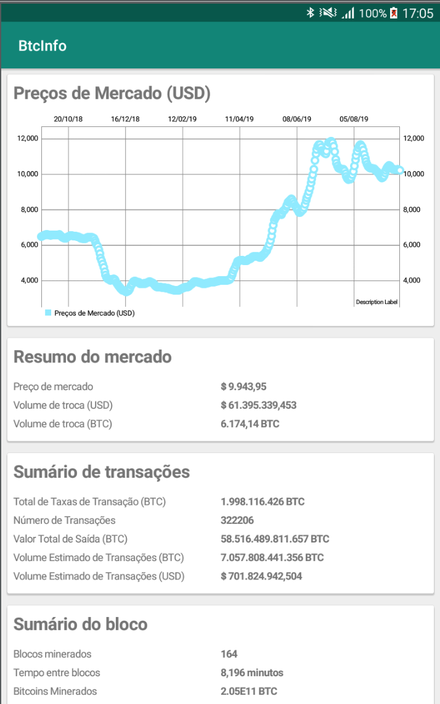

# BtcInfo  
Aplicativo Android que mostra as informações do mercado de Bitcoins desenvolvido utilizando a arquitetura reativa (redux).  
O Objetivo é demonstrar como utilizar a arquitetura, separando o código em middlewares e reducers, bem como atualizando o 
layout a partir das alterações ocorridas no App State.  

#### Middleware:  
Reponsável por sincronizar os dados com o servidor e salvar os dados no banco de dados;

#### Reducer:
Reponsável por manter sempre atualizado os dados no App State, que é utilizado na telas para mostrar as informações para o usuário

#### Listener:
Reponsável por atualizar a tela caso ocorra alguma alteração no App State.  

### API Utilizado
[Blockchain](https://www.blockchain.com/api/charts_api)  

### Biliotecas
[Redukt](https://github.com/raulccabreu/redukt)  
Biblioteca native escrita em Kotlin para arquitetura redux (participo no desenvolvimento dessa biblioteca! 🙂)

[Retrofit](https://square.github.io/retrofit/)  
HTTP Client para Android

[Gson](https://github.com/google/gson)  
Biblioteca para converter Json para Kotlin e vice versa

[ObjectBox](https://objectbox.io/)  
Banco de dados NoSQL

[Anvil](http://trikita.co/anvil/)  
Biblioteca para desenvolver layouts e views reativos para Android

[MPAndroidChart](https://github.com/PhilJay/MPAndroidChart)
Biblioteca de gráficos

### Screenshot

